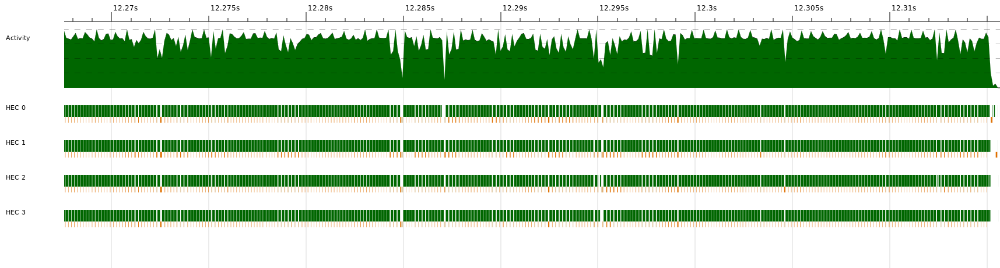

# Draigana

Author: xtp778

The code is tested using ``hspec`` and I chose a board
representation using ``Data.Sequence`` which has faster lookup and tail
operation times.

In my solution I have implemented basic ``forkIO`` lightweight thread
parallelism. For each possible moves in a given board, a lightweight thread is
spawned. The thread spawning the sub-threads wait until all the sub-threads
have returned (using a ``QSemN``). If that happens and more time is left,
the minimax depth is doubled, and the threads are started again.
The attached image shows that all (4) threads are utilised, but
that there are a lot of pausing. This is probably due to the semaphore
implementation, where the threads are forced to wait for each other. A different
approach could be to use an ``STM`` monad to calculate the heuristics
recursively. If done recursively, each calculation can be evaluated against
each other without forcing other threads to wait.

Due to time limitations I have not attempted to implement this.

Figure 1. Screenshot of a brief ``play-par`` run.

Note: while I respect the idea of having a competition, I think
it's a shame we don't have more time to develop the solution. I have only been
able to use the normalised 20 hours on this assignment.
